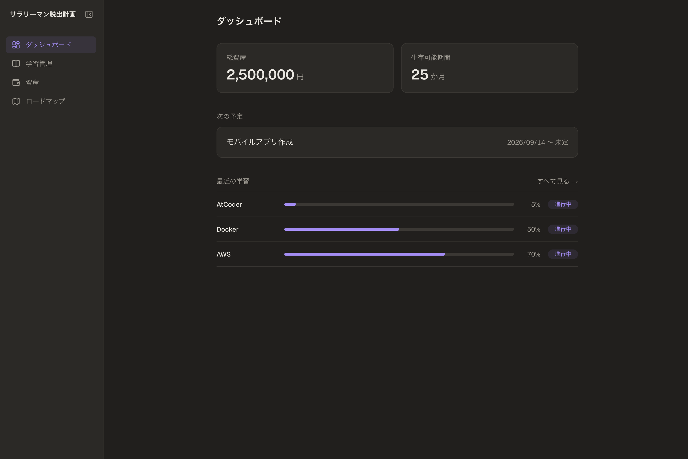
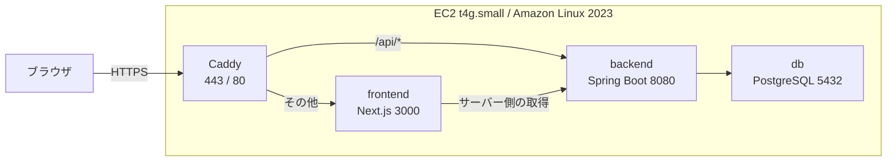

# サラリーマン脱出計画

[](https://github.com/kanioh/escape-the-office/actions/workflows/ci.yml)

**https://escape.toriangle.com**

会社員を卒業したいエンジニアのための、キャリア管理ツールです。

貯めた資産と月の生活費から「**あと何ヶ月生活できるか**」を計算し、「いつ辞められるか」を数字で把握しながら準備を進めることを目的にしています。



> MVPの段階では個人利用を前提としているため、認証機能を持たず、単一ユーザー固定で動作します。

---

## 主な機能

| 画面 | 内容 |
|---|---|
| ダッシュボード | 総資産・生存可能期間・次の予定・最近の学習をまとめて表示 |
| 学習管理 | 学習項目の追加と、スライダーによる進捗更新（未着手 / 進行中 / 完了） |
| 資産 | 資産（現金・NISA）と生活費の記録、履歴の一覧、生存期間シミュレーション |
| キャリアロードマップ | 退職・転職などの予定を月ごとに管理。終了した予定は自動的に非表示 |

資産と生活費は**同じ日付に何度でも上書きできる**（UPSERT）作りにしており、入力ミスをその場で直せます。

---

## 技術スタック

| 領域 | 技術 |
|---|---|
| フロントエンド | Next.js 16（App Router）/ React 19 / TypeScript / Tailwind CSS 4 |
| バックエンド | Spring Boot 4.1 / Java 21 / Spring Data JPA / Maven |
| データベース | PostgreSQL 17 / Flyway（マイグレーション管理） |
| コンテナ | Docker / Docker Compose |
| インフラ | AWS EC2（t4g.small / Amazon Linux 2023 / ARM）/ Elastic IP |
| リバースプロキシ | Caddy（Let's Encrypt の証明書を自動取得・自動更新） |
| DNS | Cloudflare |
| CI | GitHub Actions |

---

## システム構成

EC2 1台の上で、4つのコンテナを Docker Compose で動かしています。外部に公開しているのは Caddy だけで、アプリとデータベースはコンテナ間ネットワークからのみ到達できます。



### コンテナ構成

| サービス | 役割 | 備考 |
|---|---|---|
| `caddy` | リバースプロキシ / HTTPS 終端 | 証明書はボリュームに永続化。本番のみ起動（Compose のプロファイル） |
| `frontend` | 画面 | Next.js の standalone 出力を Node 24 alpine で実行 |
| `backend` | API | マルチステージビルド（Maven でビルド → JRE 21 で実行） |
| `db` | データベース | データはボリュームに永続化 |

### API の接続経路

Next.js は**サーバー側とブラウザ側の両方から API を呼ぶ**ため、接続先を2系統に分けています。

| 呼び出し元 | 接続先 | 環境変数 |
|---|---|---|
| サーバーコンポーネント（画面の初期表示） | `http://backend:8080`（コンテナ間で直接） | `API_BASE_URL`（実行時に読む） |
| ブラウザ（フォーム送信などの更新操作） | `/api/...`（同一オリジンの相対パス） | `NEXT_PUBLIC_API_BASE_URL`（ビルド時にJSへ埋め込まれる） |

本番では Caddy が同一ドメイン内でパスを振り分けるため、ブラウザ側は相対パスで完結します。

### API エンドポイント

| パス | 用途 |
|---|---|
| `GET /api/dashboard` | ダッシュボードに必要な情報をまとめて取得 |
| `GET /api/simulation/survival` | 生存可能期間の計算結果 |
| `GET /api/assets` / `PUT /api/assets/{date}` | 資産の一覧・登録（UPSERT） |
| `GET /api/expenses` / `PUT /api/expenses/{date}` | 生活費の一覧・登録（UPSERT） |
| `GET /api/study-items` / `POST /api/study-items` | 学習項目の一覧・追加 |
| `GET /api/study-progress` / `PUT /api/study-progress/{id}` | 学習進捗の取得・更新 |
| `GET /api/roadmap-events` / `POST` / `DELETE` | 予定の一覧・追加・削除 |

エラーは RFC 9457（ProblemDetail）形式で返します。

### データベース

Flyway でスキーマを管理し、起動時にマイグレーションを自動適用します。JPA 側は `ddl-auto: validate` とし、テーブルの作成はすべて Flyway に一元化しています。

| テーブル | 内容 |
|---|---|
| `users` | 利用者（MVP では固定の1件） |
| `asset_snapshots` | 日付ごとの資産（現金・NISA） |
| `expense_snapshots` | 見直した日ごとの月間生活費 |
| `study_items` | 学習項目 |
| `study_progress` | 学習項目ごとの進捗（状態・パーセント） |
| `roadmap_events` | キャリアの予定（開始日・終了日） |

### ディレクトリ構成

```
escape-the-office/
├── frontend/                  # Next.js
│   ├── Dockerfile
│   └── src/
│       ├── app/               # App Router（ページ）
│       ├── components/        # 画面をまたぐ部品
│       └── lib/               # API クライアント・型定義・整形関数
├── backend/                   # Spring Boot
│   ├── Dockerfile
│   └── src/main/
│       ├── java/              # Controller / Service / Repository / Entity / DTO
│       └── resources/
│           ├── application.yaml
│           └── db/migration/  # Flyway マイグレーション
├── docker-compose.yml         # db / backend / frontend / caddy
├── Caddyfile                  # 本番のリバースプロキシ設定
└── .github/workflows/ci.yml   # CI
```

---

## ローカルでの起動方法

### 必要なもの

- JDK 21
- Node.js 24 以上
- Docker Desktop

### 1. 日常の開発（ホットリロードあり）

```bash
# PostgreSQL を起動（起動時に Flyway がマイグレーションを適用）
docker compose up -d db

# バックエンド（http://localhost:8080）
./backend/mvnw -f backend/pom.xml spring-boot:run

# フロントエンド（http://localhost:3000）
npm --prefix frontend run dev
```

### 2. 本番相当（すべてコンテナ）

```bash
docker compose up -d --build
```

`http://localhost:3000` で起動します。Caddy はローカルでは起動しません（証明書を取得できるドメインが無いため、Compose のプロファイルで本番のみ対象にしています）。

データベースの接続情報は環境変数で差し替えられます。設定例は `.env.example` を参照してください。

---

## テストと CI

| 対象 | 内容 |
|---|---|
| バックエンド | JUnit 5 / Mockito / AssertJ による **85 件**（Service の単体テスト、`@WebMvcTest` による Controller のテスト、起動確認） |
| フロントエンド | TypeScript の型チェック、ESLint、本番ビルド |

`main` への push とプルリクエストで GitHub Actions が上記を自動実行します。バックエンドのテストは PostgreSQL のサービスコンテナを起動して実行しています。

```bash
# 手元で実行する場合
docker compose up -d db
./backend/mvnw -f backend/pom.xml test

npm --prefix frontend run lint
npm --prefix frontend run build
```
