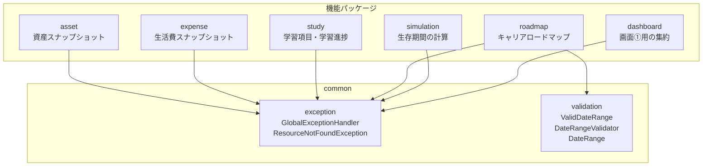
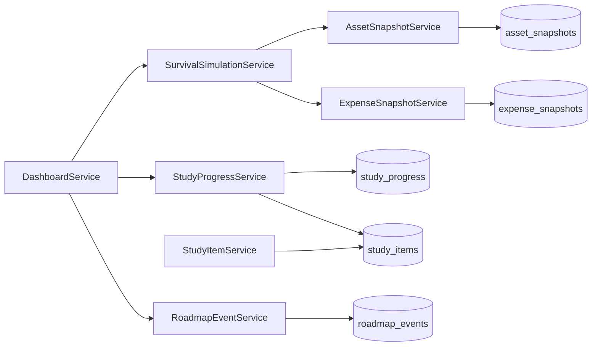
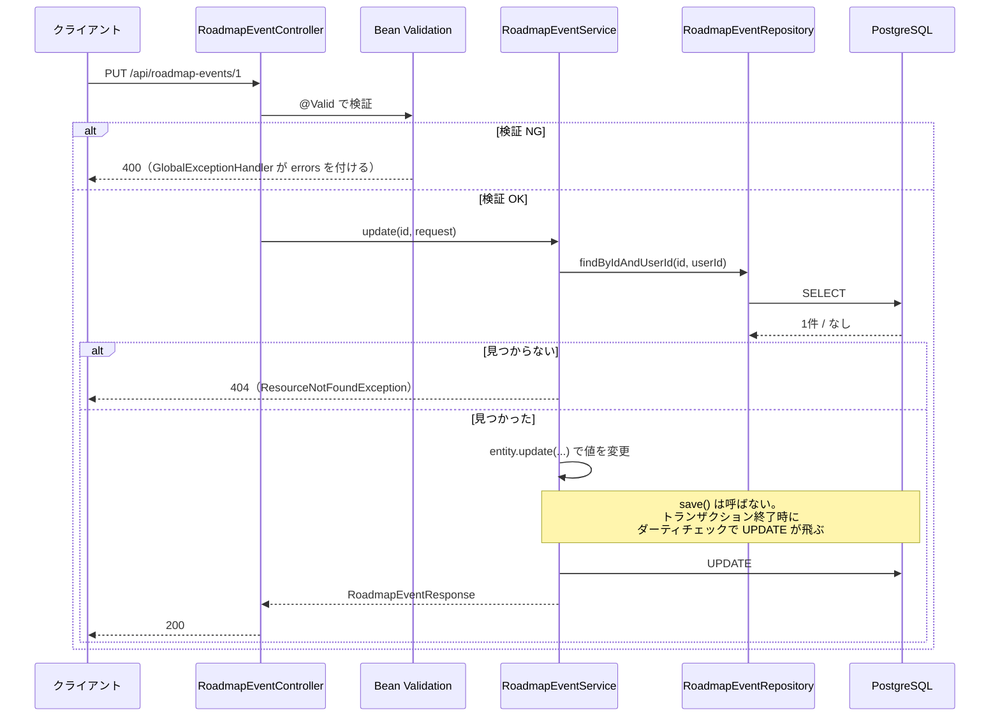
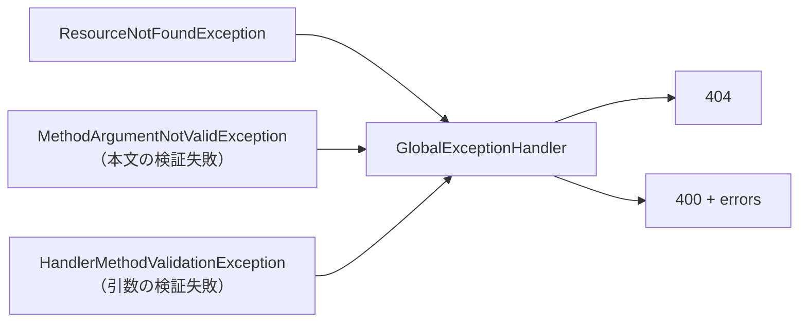

# アーキテクチャ

バックエンド（Spring Boot）の構成と、ファイル同士の関係を図にしたもの。

---

## 1. パッケージ構成

機能ごとにパッケージを分け、その中に Controller / Service / Repository / Entity / DTO を置く。
層ごと（`controller/` `service/` …）に分ける方式は採らない。
**1つの機能を触るときに1つのフォルダだけ見ればよい**ようにするため。

`common` は複数の機能から使われるものだけを置く。1箇所でしか使わないものは機能パッケージの中に置く。

---

## 2. Service 間の依存 ← ここが分かりにくい部分

`simulation` と `dashboard` は**自分のテーブルを持たない**。
既存の Service を呼び合わせて結果を組み立てるだけなので、Repository も持たない。

読み方のポイント。

- **矢印は「呼ぶ側 → 呼ばれる側」。** 逆向きの依存（`AssetSnapshotService` が `DashboardService` を呼ぶ）は無い
- `DashboardService` は 3つの Service を束ねるだけで、DB には直接触らない
- `StudyProgressService` だけが **2つの Repository** を使う。学習項目マスタと進捗を突き合わせるため

---

## 3. リクエストの流れ

`PUT /api/roadmap-events/1` を例に、1リクエストが層をどう流れるか。

**注目点は2つ。**

- `@Valid` は Controller に入った直後に働く。Service には正しい値しか届かない
- 更新時に `save()` を呼んでいない。JPA が取得時の値を覚えていて、変わっていれば自動で UPDATE を発行する（ダーティチェック）

---

## 4. 各層の役割

| 層 | 役割 | やらないこと |
|---|---|---|
| Controller | URL とメソッドの対応、`@Valid` の起動、ステータスコードの決定 | 業務ルールの判断 |
| Service | 業務ルール、トランザクションの境界 | HTTP を意識すること |
| Repository | DB アクセス | 判断（並び順の指定までは持つ） |
| Entity | テーブル1行を表す。**自身の状態を変えるメソッドを持つ** | setter を項目ごとに公開すること |
| DTO | 外部とのやり取りの形。詰め替えだけ | 既定値で埋めるなどの判断 |

Entity と DTO の使い分け。

- **Entity は外に出さない。** Controller が返すのは必ず DTO
- 詰め替えるだけなら DTO に `from()` を置く。**判断が入るなら Service** に置く
  （例: `StudyProgressResponse` は「進捗が未登録なら 0%」という判断があるので `from()` を持たない）

---

## 5. 例外から HTTP ステータスへの変換

Controller で `try-catch` を書かず、例外を投げっぱなしにする。
`GlobalExceptionHandler` が受け取って RFC 9457（ProblemDetail）形式に変換する。

`HandlerMethodValidationException` は、**URL のパラメータに制約を付けたとき**に飛ぶ。
`@PathVariable @PastOrPresent LocalDate recordedOn` のように書くと検証の仕組み自体が切り替わり、
本文の検証もこちらの経路に統合される。詳細は `spring-notes.md` を参照。

---

## 6. 現時点の制約

| 項目 | 状態 |
|---|---|
| 認証 | **無い。** 全 Service が `CURRENT_USER_ID = 1L` 固定 |
| 他人のデータの保護 | `findByIdAndUserId` で条件に含めてはいる（認証導入時に効く） |
| スキーマ管理 | Flyway に一元化。Hibernate は `ddl-auto: validate` で検査のみ |
