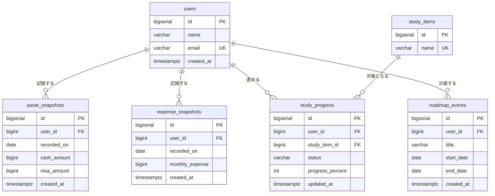

# DB設計

MVP（画面①〜④）に必要なテーブルの設計と、その判断理由を記録する。
画面仕様は [spec.md](spec.md) を参照。

---

## 前提

- 利用者は自分自身のみ。**MVP では認証を実装せず、固定ユーザー（`user_id = 1`）を使う**
- DB は PostgreSQL 17。スキーマは Flyway で管理し、JPA には作らせない（`ddl-auto: validate`）
- 将来 AWS（RDS）へ移行する前提で、環境差異を生まない型を選ぶ

---

## 共通の設計方針

| 項目 | 方針 | 理由 |
|---|---|---|
| 主キー | `BIGSERIAL` | `SERIAL`（約21億）は削除行の番号が再利用されないため意外に枯渇する。到達後の型変更は全行書き換えを伴い高コスト |
| 金額 | `BIGINT`（円単位の整数） | 浮動小数点は誤差が出るため論外。日本円は最小単位が1円で小数が不要なので、`NUMERIC` より単純・高速な整数で足りる |
| 日時 | `TIMESTAMPTZ` | `TIMESTAMP` はタイムゾーン情報を持たないため、UTC 既定の AWS 上とローカル（JST）で解釈がずれる。_at |
| 日付のみ | `DATE` | 時刻を持つと「同じ日なのに別レコード」となりユニーク制約が機能しない。_on |
| 区分値 | `VARCHAR` + `CHECK` | 数値コードは DB を直接見て意味が分からない。PostgreSQL の ENUM 型は値の追加に `ALTER TYPE` が必要で運用が硬い。Java 側は enum + `@Enumerated(EnumType.STRING)` で受ける |
| 論理名 | `COMMENT ON` で DB に保存 | 設計書とスキーマが乖離しても、DB を見れば列の意味が分かる |
| 制約名 | `uq_` / `ck_` / `idx_` の接頭辞 + テーブル名 + 列名 | 違反時のエラーメッセージから原因を特定しやすい。自動生成名に頼らない |

---

## ER図



---

## テーブル定義

### users（ユーザー）

| 列 | 論理名 | 型 | 制約 |
|---|---|---|---|
| id | ユーザーID | BIGSERIAL | PK |
| name | 氏名 | VARCHAR(100) | NOT NULL |
| email | メールアドレス | VARCHAR(255) | NOT NULL, UNIQUE |
| created_at | 登録日時 | TIMESTAMPTZ | NOT NULL, DEFAULT now() |

### asset_snapshots（資産スナップショット）

| 列 | 論理名 | 型 | 制約 |
|---|---|---|---|
| id | 資産スナップショットID | BIGSERIAL | PK |
| user_id | ユーザーID | BIGINT | NOT NULL, FK → users(id) ON DELETE CASCADE |
| recorded_on | 記録日 | DATE | NOT NULL |
| cash_amount | 現金残高（円） | BIGINT | NOT NULL, CHECK >= 0 |
| nisa_amount | NISA評価額（円） | BIGINT | NOT NULL, DEFAULT 0, CHECK >= 0 |
| created_at | 登録日時 | TIMESTAMPTZ | NOT NULL, DEFAULT now() |

- `uq_asset_snapshots_user_date`: UNIQUE (user_id, recorded_on)
- 「現在の貯金」は `recorded_on` が最大の行を取得する

### expense_snapshots（生活費スナップショット）

| 列 | 論理名 | 型 | 制約 |
|---|---|---|---|
| id | 生活費スナップショットID | BIGSERIAL | PK |
| user_id | ユーザーID | BIGINT | NOT NULL, FK → users(id) ON DELETE CASCADE |
| recorded_on | 記録日 | DATE | NOT NULL |
| monthly_expense | 月間生活費（円） | BIGINT | NOT NULL, CHECK > 0 |
| created_at | 登録日時 | TIMESTAMPTZ | NOT NULL, DEFAULT now() |

- `uq_expense_snapshots_user_date`: UNIQUE (user_id, recorded_on)

### study_items（学習項目マスタ）

| 列 | 論理名 | 型 | 制約 |
|---|---|---|---|
| id | 学習項目ID | BIGSERIAL | PK |
| name | 学習項目名 | VARCHAR(100) | NOT NULL, UNIQUE |

初期データ: Spring Boot / AWS / Docker / AtCoder / TryHackMe

### study_progress（学習進捗）

| 列 | 論理名 | 型 | 制約 |
|---|---|---|---|
| id | 学習進捗ID | BIGSERIAL | PK |
| user_id | ユーザーID | BIGINT | NOT NULL, FK → users(id) ON DELETE CASCADE |
| study_item_id | 学習項目ID | BIGINT | NOT NULL, FK → study_items(id) ON DELETE RESTRICT |
| status | 進捗ステータス | VARCHAR(20) | NOT NULL, DEFAULT 'NOT_STARTED', CHECK IN ('NOT_STARTED','IN_PROGRESS','DONE') |
| progress_percent | 進捗率（％） | INT | NOT NULL, DEFAULT 0, CHECK BETWEEN 0 AND 100 |
| updated_at | 更新日時 | TIMESTAMPTZ | NOT NULL, DEFAULT now() |

- `uq_study_progress_user_item`: UNIQUE (user_id, study_item_id)
- `idx_study_progress_item`: INDEX (study_item_id)
- `updated_at` は PostgreSQL 側で自動更新されないため、JPA（`@PreUpdate`）で更新する

### roadmap_events（キャリアロードマップ予定）

| 列 | 論理名 | 型 | 制約 |
|---|---|---|---|
| id | 予定ID | BIGSERIAL | PK |
| user_id | ユーザーID | BIGINT | NOT NULL, FK → users(id) ON DELETE CASCADE |
| title | 予定タイトル | VARCHAR(200) | NOT NULL |
| start_date | 開始日 | DATE | NOT NULL |
| end_date | 終了日 | DATE | NULL 可（未定を表す） |
| created_at | 登録日時 | TIMESTAMPTZ | NOT NULL, DEFAULT now() |

- `ck_roadmap_events_date_order`: CHECK (end_date IS NULL OR end_date >= start_date)
- `idx_roadmap_events_user_start`: INDEX (user_id, start_date)

---

## 主要な設計判断

### 1. 資産・生活費を「履歴型」にした

`spec.md` の原案はユーザーごとに1行を持ち更新のたびに上書きする形だったが、**日付ごとに1行を追加する履歴型**に変更した。

- 上書き型では過去の推移が残らず、ダッシュボードで資産の増減グラフを描けない
- 「生存期間シミュレーター」は将来予測だが、**実績の推移と並べて見られる方が価値が高い**
- 追加コストは `recorded_on` 列とユニーク制約のみで小さい

最新値が必要な場面では `recorded_on` の最大値を持つ行を取得する。

### 2. ON DELETE をテーブルごとに使い分けた

| 参照先 | 指定 | 理由 |
|---|---|---|
| users | CASCADE | ユーザーを削除するなら、そのユーザーの記録も消えるのが自然 |
| study_items | RESTRICT | マスタの削除は事故であることが多い。蓄積した進捗記録を巻き添えで失わないよう DB 側で止める |

### 3. インデックスは検索パターンから逆算して最小限にした

インデックスは書き込みコストと容量を消費するため、想定クエリに対して必要な分だけ作る。

| テーブル | 追加インデックス | 判断 |
|---|---|---|
| asset_snapshots / expense_snapshots | なし | 外部キーは `user_id` のみで、複合ユニーク `(user_id, recorded_on)` の**左端**にあるため既にカバーされている |
| study_progress | `(study_item_id)` | 複合ユニークは `(user_id, study_item_id)` の順であり、左端プレフィックス規則により `study_item_id` 単独の検索には使えない。`study_items` 削除時の参照チェックにも必要 |
| roadmap_events | `(user_id, start_date)` | 主要クエリが `WHERE user_id = ? ORDER BY start_date`。等値で絞る列を先、並べ替え列を後にすることで、絞り込みとソートを同時に処理できる（ソート処理自体が不要になる） |

### 4. 初期データで id を明示指定しない

`BIGSERIAL` の採番はシーケンスが担っており、`INSERT` で id を明示するとシーケンスのカウンタが進まない。その後アプリから採番すると既存 id と衝突して重複キー違反になるため、初期データでも id は指定せず自動採番に任せる。

---

## Flyway 運用ルール

マイグレーションは `backend/src/main/resources/db/migration/` に配置し、アプリ起動時に自動適用される。

| ファイル | 内容 |
|---|---|
| `V1__create_users.sql` | users |
| `V2__create_asset_and_expense_snapshots.sql` | asset_snapshots, expense_snapshots |
| `V3__create_study_tables.sql` | study_items, study_progress |
| `V4__create_roadmap_events.sql` | roadmap_events |
| `V5__insert_initial_data.sql` | 固定ユーザー、学習項目マスタ |

**適用済みのファイルは編集しない。** Flyway はチェックサムを履歴テーブルに保存しており、変更を検知すると起動を中止する。スキーマを変更する場合は新しい `V6__*.sql` を追加する。

開発初期でデータを捨ててよい場合に限り、以下でやり直せる。

```
docker compose down -v   # -v でボリュームごと削除
docker compose up -d db
```

---

## 対象外（Version2 以降）

エージェント管理・案件管理・AIキャリア相談は MVP に含めない。詳細は [spec.md](spec.md) を参照。
